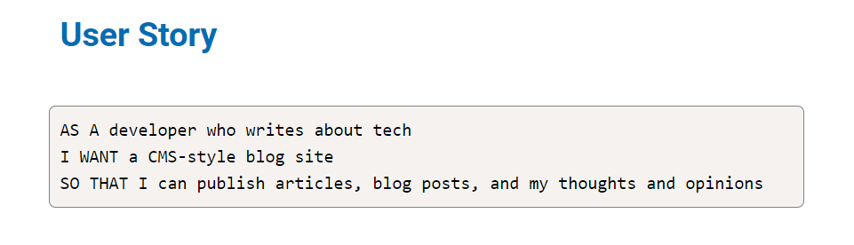
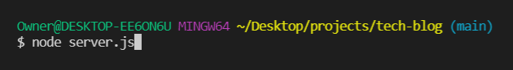
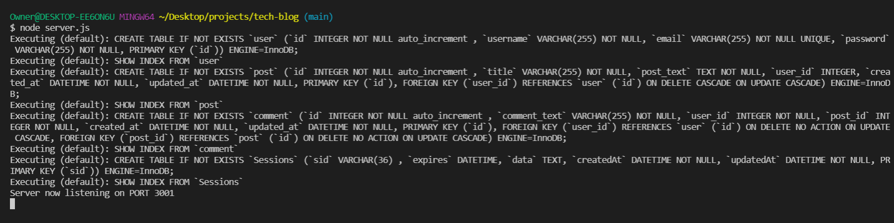
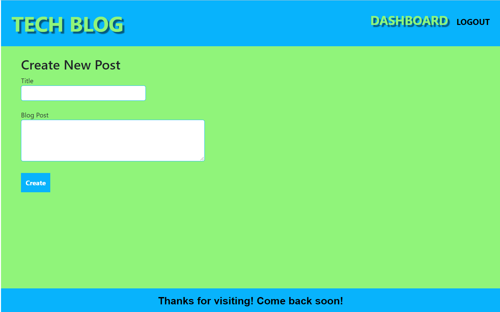
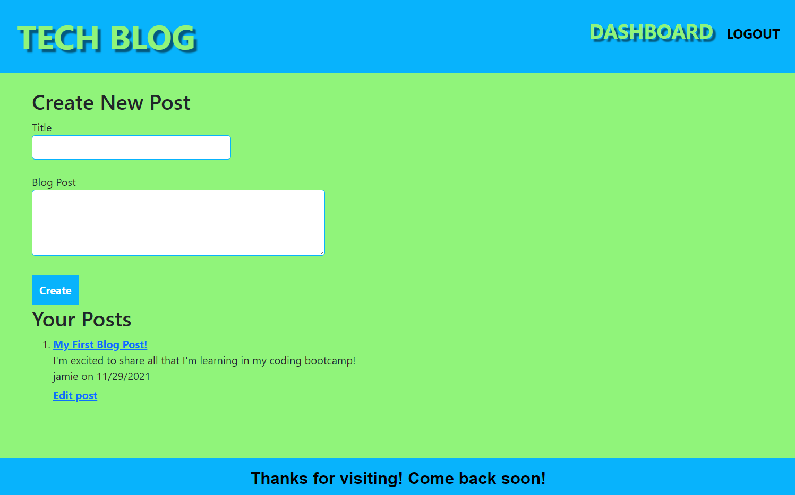
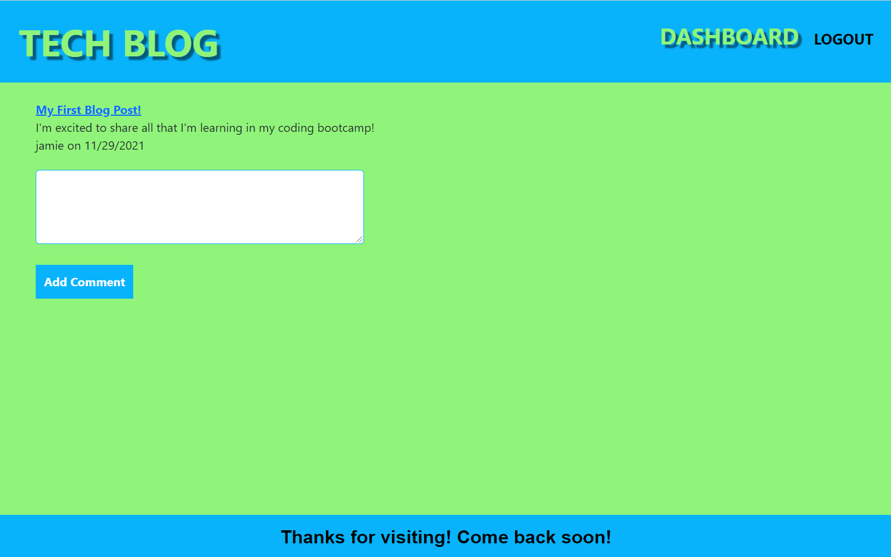
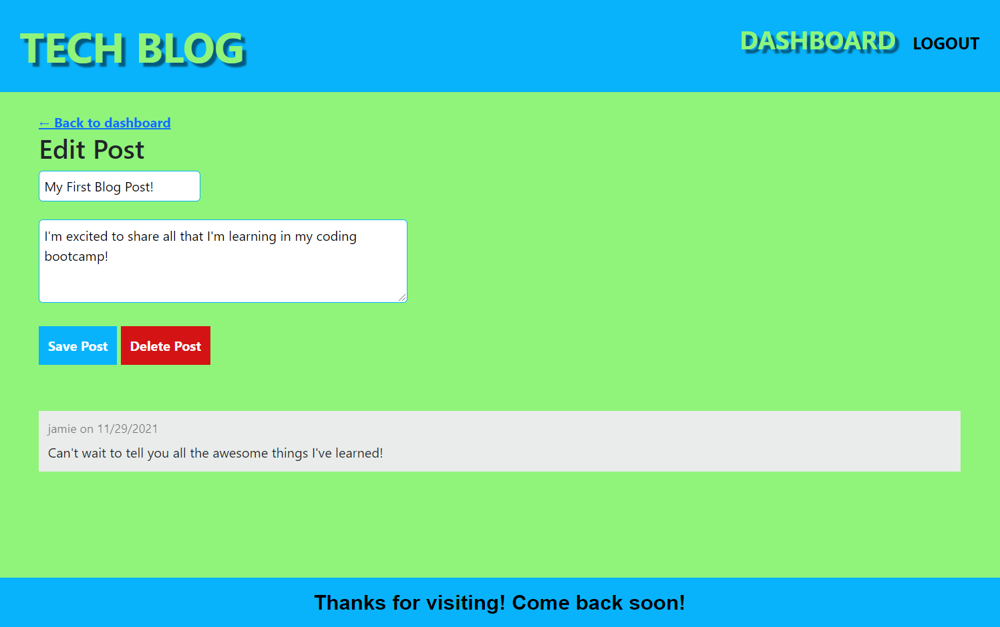

# Welcome to my TECH BLOG!

## Description

#### This TECH BLOG allows users to sign in and create an account to be able to publish articles, blog posts, thoughts, and opinions. There are options to comment on posts, edit, and delete posts.

## Table of Contents
* [Installation](#installation)
* [Usage](#usage)
* [License](#license)
* [Contributor](#contributor)

## Installation
In order to install this repository, you will need to clone it and run npm init and npm install to install all of the dependencies listed inside the package.json file.

## Usage
To use this app after cloning and initializing the dependencies, run server.js in the terminal to start it.

You will then see the confirmation that the port is listening.

When you open the port in the browser, the homepage will open with the option to login on the right side of the navigation bar.

When you click on the login option, you will be directed to the login page where you can login if you already have an account, or create an account with your name, email address, and password.

Once you create an account, you can then login with your information next session.

Once you have created an account, you will have the ability to create a post.

You can create as many posts as you would like. Your previous posts will display under the create new post section.

While you are signed in, you will also have access to comment on your post or other posts.

When you are logged in, you will be able to edit or delete your posts as well.

Whether you are signed in or not, you will have access to view all the posts that are on the app.

### I hope you enjoy using my TECH BLOG! I welcome all contributions and feedback!

## License
The license for this project is the MIT.

Copyright © 2021

## Contributor
*If you have any questions, please reach out to me.*

### _Jamie Williams_ 

Jamie's GitHub: [@jamwil1226](https://github.com/jamwil1226/)